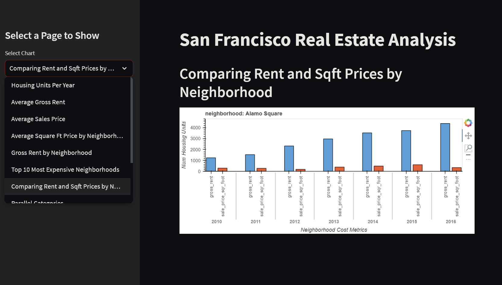
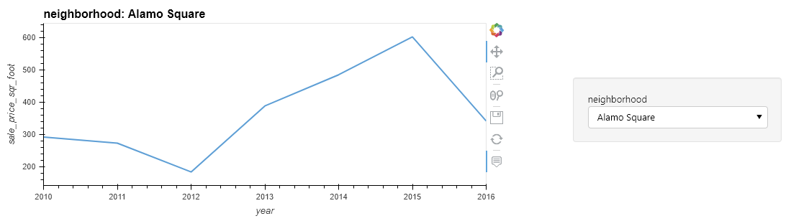
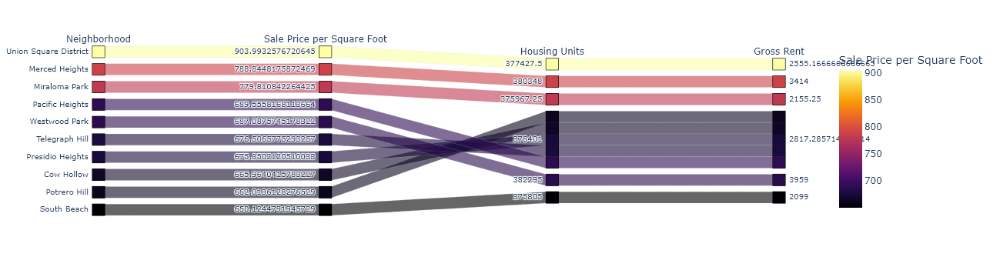

# San Francisco Real Estate Dashboard

## Background

In this project I cleaned and manipulated real estate data from San Francisco before visually plotting it in several variations. I have built a Streamlit dashboard showcasing the visualizations.

## To run the dashboard:
- Download the dashboard.py file as well as the Data folder and save them within the same folder.
- Create a .env file with VScode named api.env
- Open the file in VScode and write `mapbox = "your mapbox API key here"` and save
- Open terminal, activate the python environment in which Streamlit is installed, and navigate to the folder that dashboard.py is saved in
- Run `streamlit run dashboard.py`

## About the dashboard

Use the sidebar to select each chart. 

Hvplot charts are interactive in python but not in streamlit. These charts allow you to view the data for each neighborhood.

Plotly express charts are interactive in the dashboard; you can drag each column left and right to find correlations.

The dashboard is built by defining functions that output each plot, and then selectively calling each function when the name of the plot is selected in the sidebar dropdown. Types of plots include pandas plots, matplotlib, hvplots, and plotly express. Open rental_analysis.ipynb if you want to see all of the work.